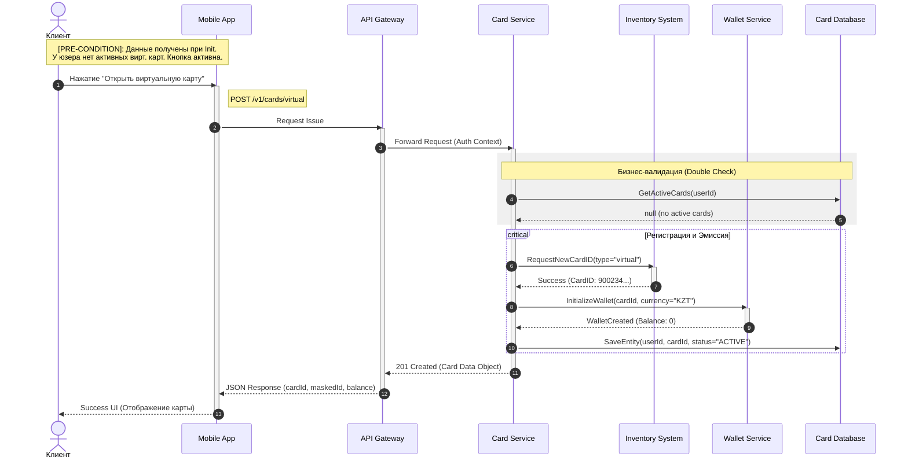

# Спецификация процесса: Эмиссия виртуальных карт (Virtual Card Issuance)

## 1. Обзор (Overview)
Документ описывает логику и техническую реализацию процесса выпуска новой виртуальной карты для клиента. Процесс включает в себя проверку существующих продуктов пользователя.

## 2. Бизнес-правила
* **Условие выпуска**: Виртуальная карта выпускается только при отсутствии у пользователя активной карты выбранного типа.

## 3. Сценарий взаимодействия (Sequence Diagram)

## 4. Обработка исключительных ситуаций (Error Handling)
401 Unauthorized	Ошибка авторизации	Токен не передан, просрочен или подделан.
409 Conflict	Карта уже существует	В БД найдена активная карта того же типа для данного userId.
